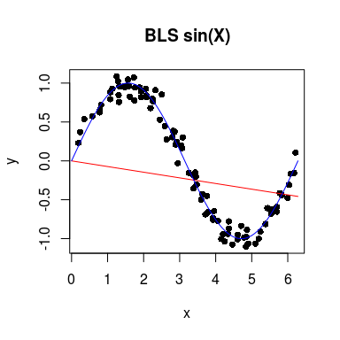
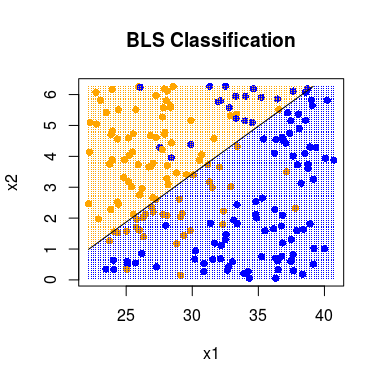

# Assignment 2
Doug Raffle  
<!-- YAML header to specify document properties -->


## Individual Effort

1. Implement your own Least Squares classifier
    a. Apply it to the $sin(x)$ regression example below.
    b. Apply it to the simulated classification example.
2. Implement your own k-NN function
    a. Apply it to the $sin(x)$ regression example below.
    b. Apply it to the simulated classification example.

<!-- Each of the code chunks can be left empty, students can fill in -->
<!-- their solutions in the document -->

## Global Code
###$sin(x)$

```r
run.sinx <- function(BLS_Flag = TRUE, k = 1, ...){
    set.seed(100)
    x <- runif(100, 0, 2*pi)
    y <- sin(x) + rnorm(100, 0, 0.1)

    xgrid <- seq(0, 2*pi, length=500)
    n <- length(xgrid)
    ygrid <- vector(length=n)

    ygrid <- sapply(1:n, function(i){
                        ifelse(BLS_Flag,
                               bls(xgrid[i], x, y),
                               knn(xgrid[i], x, y, k)
                        )
             })
    titl <- ifelse(BLS_Flag, "BLS sin(X)", "KNN sin(X)")
    plot(x, y, pch = 16, main = titl)
    lines(xgrid, ygrid, col=c("red"))
    lines(xgrid, sin(xgrid), col=c("blue"))
}
```
### Classifier

```r
x <- read.table("dat_2.txt", FALSE)
y <- x[,3]
x <- x[,-3]
x <- as.matrix(x)

xgrid1 <- seq(min(x[,1]), max(x[,1]), length = 100)
xgrid2 <- seq(min(x[,2]), max(x[,2]),length = 100)
n <- length(xgrid1)
zgrid <- matrix(0,n,n)

run.classify <- function(BLS_Flag = TRUE, k = 1, ...){
    zgrid <- t(sapply(1:n, function(i){
                          sapply(1:n, function(j){
                                     ifelse(BLS_Flag,
                                            bls(c(xgrid1[i], xgrid2[j]), x, y),
                                            knn(c(xgrid1[i], xgrid2[j]), x, y, k)
                                     )
                          })
             }))
    titl <- ifelse(BLS_Flag, "BLS Classification", "KNN Classification")
    plot(x, col=c("orange","blue")[y+1], pch=16, xlab="x1", ylab="x2", main=titl)
    sapply(1:n, function(i){
	val<-as.numeric(zgrid[,i] >= 0.5) + 1
	points(xgrid1,rep(xgrid2[i],n), pch = ".", col = c("orange", "blue")[val])
    })
    contour(x = xgrid1, y = xgrid2, z = zgrid, levels = 0.5, add = TRUE, 
            drawlabels = FALSE)
}
```


## 1. Implement LSR
complete the `bls` function:


```r
bls <- function(x0,x,y){
    x0 %*% (solve(t(x) %*% x) %*% t(x) %*% y)
}
```

### a. Apply it to the $sin(x)$ example

```r
run.sinx(BLS_Flag = TRUE)
```

 

### b. Apply it to the classification example

```r
run.classify(BLS_Flag = TRUE)
```

 

## 2. Implement KNN
Complete the `knn` function

```r
knn <- function(x0, x, y, k){
    dis <- apply(as.matrix(x), 1, function(r) sum((x0 - r)^2))
    mean(y[head(order(dis), k)])
}
```

### a. Apply it to the $sin(x)$ example

```r
run.sinx(BLS_Flag = FALSE, k = 5)
```

 

### b. Apply it to the classification example

```r
run.classify(BLS_Flag = FALSE, k = 5)
```

 
